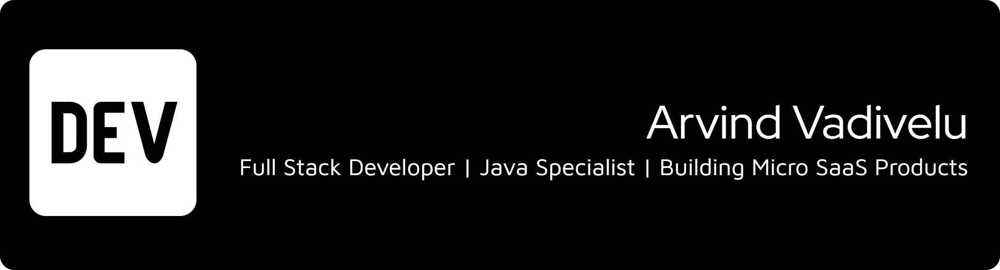

  

  

  <h1 align="center">
    Arvind Vadivelu
  </h1>

  <h2>
    🚀 Full Stack SDE | Java Specialist | Building Micro SaaS To Solve Real-World Problems
  </h2>
   

  

    
    
    
    
  

## 👨‍💻 About Me

I am a results-driven software engineer focused on building robust back-end systems and dynamic front-end interfaces. I thrive on solving complex architectural challenges and optimizing application performance.

* 🔭 I’m currently working on **Building high-availability microservices**
* 🌱 I’m currently learning **Rust and Advanced Kubernetes patterns**
* 👯 I’m looking to collaborate on **Open Source Dev Tooling**
* ⚡ **Core Philosophy:** Always code as if the guy who ends up maintaining your code will be a violent psychopath who knows where you live.

 

## 💼 Professional Experience

###  Senior Software Engineer @ **TechGiant Corp**
**Duration:** Jan 2023 - Present

**Key Contributions:**
* 🚀 Engineered a distributed microservices architecture serving **1M+ daily active users** with 99.99% uptime availability.
* 📊 Optimized database indexing and query strategies, reducing system API latency by **40%**.
* 👥 Led and mentored a cross-functional team of **5 developers** in an Agile environment.
* 🔧 Implemented automated CI/CD pipelines using GitHub Actions, cutting deployment time by **60%**.
* 🏆 Awarded "Innovator of the Quarter" for developing a custom internal data visualization tool.

**Tech Stack Used:**

  

 

###  Software Developer @ **Innovative Startup**
**Duration:** Jun 2020 - Dec 2022

**Key Contributions:**
* 💻 Architected the core frontend using **React & Redux**, driving a 25% increase in user engagement.
* 🔒 Overhauled application security by implementing robust **OAuth2 and JWT** authentication protocols.
* 🤝 Collaborated extensively with UI/UX designers to translate Figma concepts into responsive code.
* 📉 Reduced AWS infrastructure costs by **30%** through serverless function optimization.
* 🧪 Championed test-driven development, increasing unit test coverage from 40% to **85%**.

**Tech Stack Used:**

  

---

## 🏆 Achievements & Milestones

  

 

* 🥇 **Winner, Global AI Hackathon 2023** - Developed an award-winning predictive model.
* 📜 **AWS Certified Solutions Architect Associate** - Validated cloud architecture expertise.
* 🌟 **Top Contributor Recognition** - Recognized for significant contributions to major React Open Source libraries.

---

## 🛠️ Technical Skills

### Frontend Development

### Backend & Database

### DevOps & Cloud

### Tools & Workflow

---

## 📊 GitHub Statistics

  
    
  
    
  

---

## 🚀 Featured Projects

### 📂 [AI-Powered Task Manager](https://github.com/YOUR_GITHUB_USERNAME/project-1)
A revolutionary smart assistant that uses machine learning to predict your next tasks and optimize your daily schedule.
 
**Tech:** 

 

### 📂 [Real-time E-commerce Dashboard](https://github.com/YOUR_GITHUB_USERNAME/project-2)
A high-performance dashboard providing live analytics, inventory management, and seamless payment processing integration.
 
**Tech:** 

 

### 📂 [Data Structure Utility Library](https://github.com/YOUR_GITHUB_USERNAME/project-3)
An open-source TypeScript library designed to simplify complex data manipulation for front-end developers.
 
**Tech:** 

---

  <h2>⚡ Let's Connect!</h2>
  
  

    
  
  
Made with ❤️ by <a href="https://github.com/YOUR_GITHUB_USERNAME">Your Name</a>

